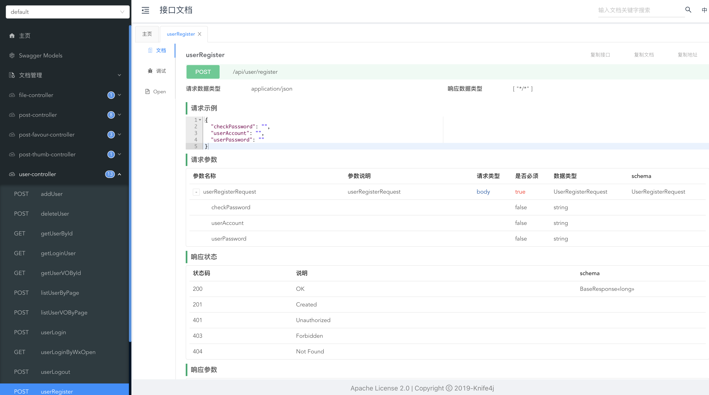

# SpringBoot Project Initial Template

> Author：[Yifan Wen](https://github.com/Dannywen1213dup)
> Shared [ai4labOS](https://www.ai4labos.com/)

A SpringBoot project initial template based on Java, integrating common frameworks and sample code for mainstream business scenarios.

 
 

## Features

### Mainstream Frameworks & Features

- Spring Boot 2.7.x (Latest)
- Spring MVC
- MyBatis + MyBatis Plus data access (with pagination enabled)
- Spring Boot debugging tools and project processors
- Spring AOP aspect-oriented programming
- Spring Scheduler scheduled tasks
- Spring transaction annotations

### Data Storage

- MySQL database
- Redis in-memory database
- Elasticsearch search engine
- AWS S3 object storage

### Utility Classes

- Easy Excel spreadsheet processing
- Hutool utility library
- Apache Commons Lang3 utility classes
- Lombok annotations

### Business Features

- Business code generator (supports automatic generation of Service, Controller, and data model code)
- Spring Session Redis distributed login
- Global request/response interceptor (logging)
- Global exception handler
- Global exception handler
- Custom error codes
- Encapsulated common response classes
- Swagger + Knife4j API documentation
- Custom permission annotations + global validation
- Global CORS handling
- Long integer precision loss solution
- Multi-environment configuration


## Business Functions

- Provides sample SQL (user, post, post thumb, post favour tables)
- User login, registration, logout, update, search, permission management
- Post creation, deletion, editing, update, database search, flexible ES search
- Post thumb, cancel thumb
- Post favour, cancel favour, search favour posts
- Post full sync to ES, incremental sync to ES scheduled tasks
- Support business-specific file upload

### Unit Testing

- JUnit5 unit testing
- Sample unit test classes

### Architecture Design

- Reasonable layering


## Quick Start
 

### MySQL Database

1) Modify the database configuration in `application.yml` to your own:

```yml
spring:
  datasource:
    driver-class-name: com.mysql.cj.jdbc.Driver
    url: jdbc:mysql://localhost:3306/my_db
    username: root
    password: 123456
```

2) Execute the database statements in `sql/create_table.sql` to automatically create the database and tables

3) Start the project and visit `http://localhost:8101/api/doc.html` to open the API documentation. You can debug APIs online without writing frontend code~



### Redis Distributed Login

1) Modify the Redis configuration in `application.yml` to your own:

```yml
spring:
  redis:
    database: 1
    host: localhost
    port: 6379
    timeout: 5000
    password: 123456
```

2) Modify the session storage method in `application.yml`:

```yml
spring:
  session:
    store-type: redis
```

3) Remove the exclude parameter from the `@SpringBootApplication` annotation at the beginning of the `MainApplication` class:

Before modification:

```java
@SpringBootApplication(exclude = {RedisAutoConfiguration.class})
```

After modification:


```java
@SpringBootApplication
```

### Elasticsearch Search Engine

1) Modify the Elasticsearch configuration in `application.yml` to your own:

```yml
spring:
  elasticsearch:
    uris: http://localhost:9200
    username: root
    password: 123456
```

2) Copy the content from the `sql/post_es_mapping.json` file and create an index (equivalent to creating a database table) by calling the Elasticsearch API or using Kibana Dev Tools

```
PUT post_v1
{
 See sql/post_es_mapping.json file for parameters
}
```

If you don't know how to do this step, you need to learn about Elasticsearch, or search online~

3) Enable sync tasks to sync posts from the database to Elasticsearch

Find the `FullSyncPostToEs` and `IncSyncPostToEs` files in the job directory, uncomment the `@Component` annotation, and run the program again to trigger synchronization:

```java
// todo Uncomment to enable task
//@Component
```

### Business Code Generator

Supports automatic generation of Service, Controller, and data model code. Combined with the MyBatisX plugin, you can quickly develop CRUD and other practical basic functions.

Find the `generate.CodeGenerator` class, modify the generation parameters and generation path, and you can comment out unnecessary generation logic, then run it.

```
// Specify generation parameters
String packageName = "com.labOS.backend";
String dataName = "User Comment";
String dataKey = "userComment";
String upperDataKey = "UserComment";
```

After generating the code, you can move it to the actual project and modify it according to your business needs based on the `// todo` comment hints.

