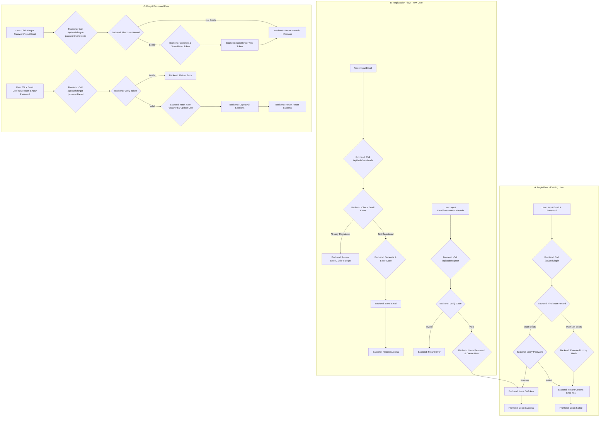
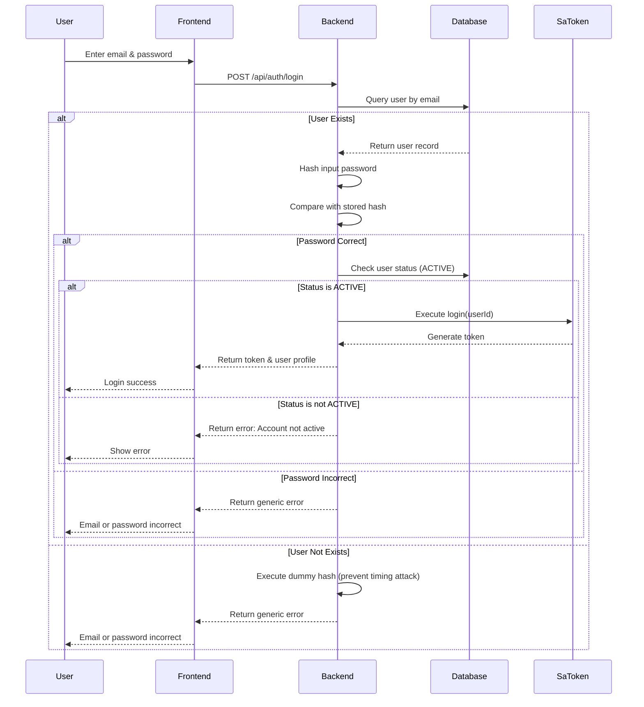
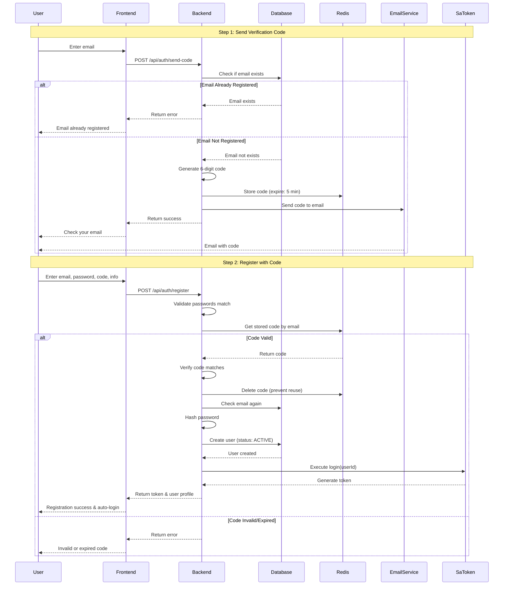
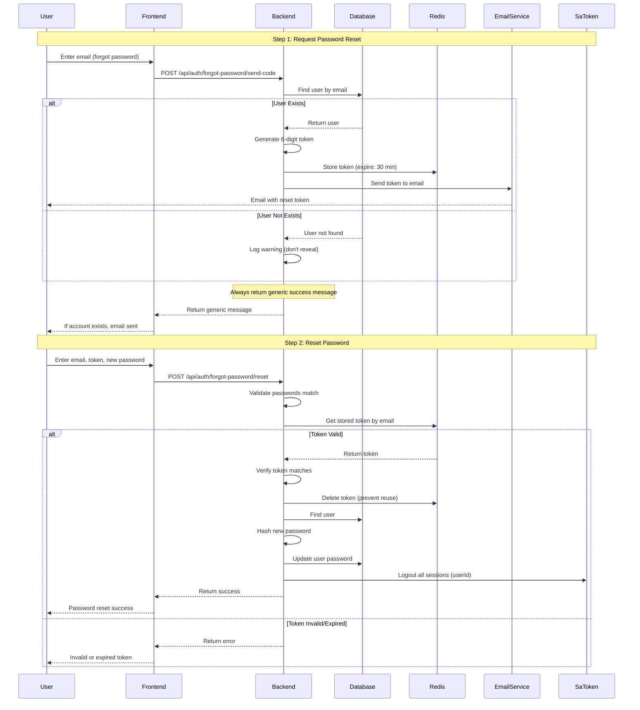
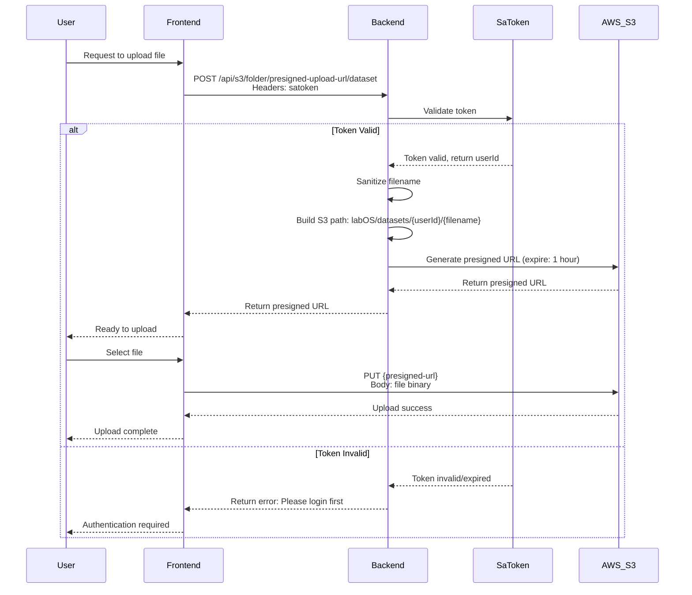
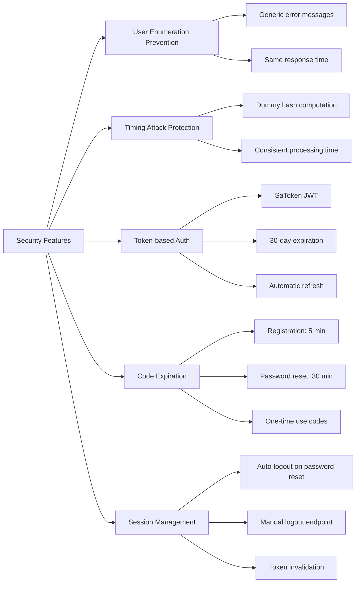
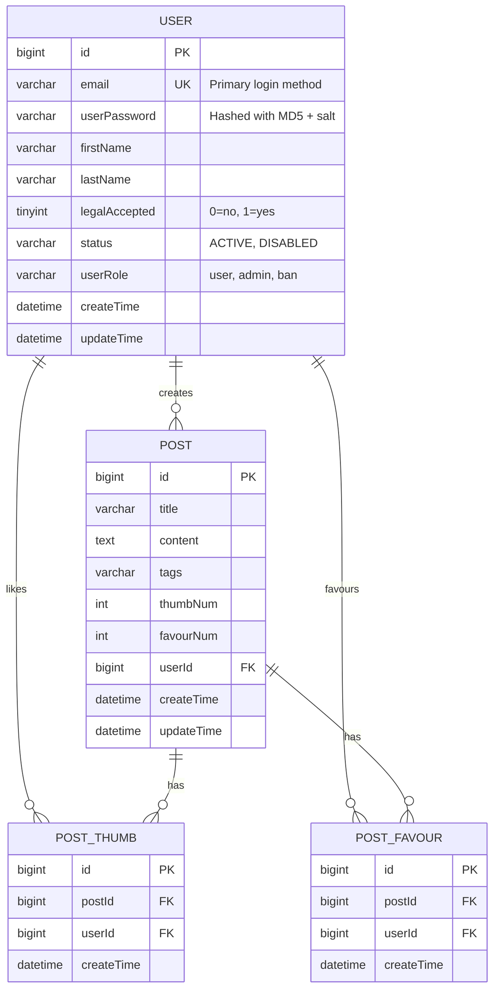

# Authentication Flow Diagrams

This document provides visual diagrams of the authentication system flows using Mermaid.

---

## Complete Authentication Flow

---

## Detailed Login Flow

---

## Detailed Registration Flow

---

## Detailed Forgot Password Flow

---

## S3 Upload Flow (Authenticated)

---

## Security Features Overview

---

## API Endpoint Summary

| Endpoint | Method | Auth Required | Purpose |
|----------|--------|---------------|---------|
| `/api/auth/login` | POST | No | Login existing user |
| `/api/auth/send-code` | POST | No | Send registration verification code |
| `/api/auth/register` | POST | No | Register new user with code |
| `/api/auth/forgot-password/send-code` | POST | No | Send password reset token |
| `/api/auth/forgot-password/reset` | POST | No | Reset password with token |
| `/api/auth/logout` | POST | Yes | Logout current user |
| `/api/s3/folder/presigned-upload-url/dataset` | POST | Yes | Generate dataset upload URL |
| `/api/s3/folder/presigned-upload-url/benchmark-eval` | POST | Yes | Generate benchmark eval upload URL |
| `/api/s3/folder/presigned-upload-url/benchmark-eval/batch` | POST | Yes | Batch generate upload URLs |

---

## Database Schema

---

## Redis Key Structure

| Key Pattern | Value | Expiration | Purpose |
|-------------|-------|------------|---------|
| `auth:register:code:{email}` | 6-digit code | 5 minutes | Registration verification |
| `auth:reset:token:{email}` | 6-digit token | 30 minutes | Password reset verification |

---

**Last Updated**: 2024-12-06  
**Version**: 2.0.0

