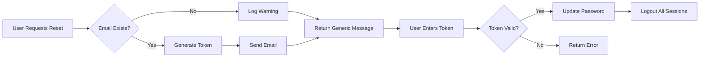

# Authentication System V2 - Implementation Summary

## Overview

This document summarizes the complete refactoring of the authentication system from v1.0 to v2.0, implementing industry-standard security practices and improved user flows.

---

## 🔄 Major Changes

### 1. **Refactored Registration Flow**

**Before (v1.0)**:
```
/api/auth/check-email → /api/auth/register/init → /api/auth/register/verify
```
- Created user with UNVERIFIED status
- Sent verification code after user creation
- Verified email to activate account

**After (v2.0)**:
```
/api/auth/send-code → /api/auth/register
```
- Check email availability before creating user
- Send verification code first
- Create user with ACTIVE status only after email verification
- Automatic login after successful registration

**Benefits**:
- ✅ Cleaner flow (2 steps instead of 3)
- ✅ No UNVERIFIED users in database
- ✅ Better user experience
- ✅ Reduced API calls

---

### 2. **Enhanced Login Security**

**New Security Features**:
- ✅ **Generic error messages**: Always returns "Email or password is incorrect" regardless of whether email exists
- ✅ **Timing attack protection**: Executes dummy hash computation when user doesn't exist
- ✅ **Prevents user enumeration**: Attackers cannot determine valid emails

**Before**:
```java
if (user == null) {
    throw new BusinessException(ErrorCode.PARAMS_ERROR, "Email does not exist");
}
if (!passwordMatch) {
    throw new BusinessException(ErrorCode.PARAMS_ERROR, "Password is incorrect");
}
```

**After**:
```java
// Always hash password (even if user doesn't exist)
String encryptedPassword = DigestUtils.md5DigestAsHex((SALT + password).getBytes());

if (user == null) {
    log.warn("Login attempt for non-existent user: {}", email);
    throw new BusinessException(ErrorCode.PARAMS_ERROR, "Email or password is incorrect");
}

if (!encryptedPassword.equals(user.getUserPassword())) {
    log.warn("Failed login attempt for user: {}", email);
    throw new BusinessException(ErrorCode.PARAMS_ERROR, "Email or password is incorrect");
}
```

---

### 3. **New Forgot Password Flow**

**Endpoints**:
1. `POST /api/auth/forgot-password/send-code` - Request password reset
2. `POST /api/auth/forgot-password/reset` - Reset password with token

**Security Features**:
- ✅ **Generic success message**: Always says "If the account exists, we have sent an email" (prevents user enumeration)
- ✅ **30-minute token expiration**: Longer than registration (5 min) for better UX
- ✅ **One-time use tokens**: Token is deleted after successful reset
- ✅ **Force logout**: All user sessions are invalidated after password reset

**Flow**:


---

### 4. **Database Schema Changes**

**User Table Updates**:

| Field | Before | After | Reason |
|-------|--------|-------|--------|
| `email` | `NULL` | `NOT NULL` | Email is required for all users |
| `status` default | `'UNVERIFIED'` | `'ACTIVE'` | Users are verified before creation |
| `status` values | `UNVERIFIED, ACTIVE, DISABLED` | `ACTIVE, DISABLED` | Removed UNVERIFIED status |

**SQL Changes**:
```sql
-- Before
`email` VARCHAR(100) NULL COMMENT 'Email address (unique, primary login method)',
`status` VARCHAR(20) DEFAULT 'UNVERIFIED' NOT NULL COMMENT 'User status: UNVERIFIED, ACTIVE, DISABLED',

-- After
`email` VARCHAR(100) NOT NULL COMMENT 'Email address (unique, primary login method)',
`status` VARCHAR(20) DEFAULT 'ACTIVE' NOT NULL COMMENT 'User status: ACTIVE, DISABLED',
```

---

### 5. **New DTO Classes**

Created 7 new DTO classes for clean API contracts:

| DTO Class | Purpose |
|-----------|---------|
| `SendCodeRequest` | Request verification code for registration |
| `SendCodeResponse` | Response after sending verification code |
| `RegisterRequest` | Complete registration with code and user info |
| `ForgotPasswordSendCodeRequest` | Request password reset token |
| `ForgotPasswordSendCodeResponse` | Generic response for password reset request |
| `ForgotPasswordResetRequest` | Reset password with token |
| `ForgotPasswordResetResponse` | Confirm password reset success |

**Key Features**:
- All use Java Bean Validation (`@Valid`, `@NotBlank`, `@Email`, `@Size`)
- Comprehensive validation messages
- Serializable for session storage

---

### 6. **Enhanced Email Service**

**New Method**:
```java
void sendPasswordResetCode(String toEmail, String resetToken);
```

**Email Templates**:
- Registration verification code (5-min expiry)
- Password reset code (30-min expiry)
- Both include security warnings

---

## 📊 API Comparison

### V1.0 Endpoints (Removed/Changed)

| Endpoint | Status |
|----------|--------|
| `POST /api/auth/check-email` | ❌ Removed (security risk) |
| `POST /api/auth/register/init` | ❌ Replaced by `/api/auth/send-code` |
| `POST /api/auth/register/verify` | ❌ Replaced by `/api/auth/register` |
| `POST /api/auth/register/resend-code` | ❌ Removed (use `/api/auth/send-code` again) |

### V2.0 Endpoints (New/Updated)

| Endpoint | Method | Auth | Description |
|----------|--------|------|-------------|
| `POST /api/auth/login` | POST | No | ✏️ Enhanced with security features |
| `POST /api/auth/send-code` | POST | No | ✨ New: Send registration code |
| `POST /api/auth/register` | POST | No | ✨ New: Register with code |
| `POST /api/auth/forgot-password/send-code` | POST | No | ✨ New: Request password reset |
| `POST /api/auth/forgot-password/reset` | POST | No | ✨ New: Reset password |
| `POST /api/auth/logout` | POST | Yes | ✅ Unchanged |
| `POST /api/s3/folder/presigned-upload-url/*` | POST | Yes | ✅ Unchanged |

---

## 🔒 Security Improvements

### 1. **User Enumeration Prevention**

**What is User Enumeration?**
An attack where adversaries determine valid usernames/emails by observing different system responses.

**V2.0 Protections**:
- Login: Generic error message for both non-existent users and wrong passwords
- Password Reset: Generic success message regardless of email existence
- Registration: Only reveals email is taken if actually registered (acceptable for UX)

### 2. **Timing Attack Protection**

**What is a Timing Attack?**
An attack that uses response time differences to infer information (e.g., valid vs invalid usernames).

**V2.0 Protection**:
```java
// Always compute hash (even if user doesn't exist)
String encryptedPassword = DigestUtils.md5DigestAsHex((SALT + password).getBytes());

if (user == null) {
    // Executed after hash computation (consistent timing)
    throw new BusinessException(ErrorCode.PARAMS_ERROR, "Email or password is incorrect");
}
```

### 3. **Token Security**

**Registration Code**:
- 6 digits (1,000,000 combinations)
- 5-minute expiration
- Single-use (deleted after verification)
- Stored in Redis with automatic expiration

**Password Reset Token**:
- 6 digits (1,000,000 combinations)
- 30-minute expiration (better UX than registration)
- Single-use (deleted after reset)
- Forces logout of all sessions after reset

### 4. **Password Security**

**Hashing**:
- Uses MD5 with salt (compatible with existing system)
- Salt: `"labOS_backend"` (defined in `UserServiceImpl.SALT`)
- Minimum 8 characters required
- Frontend validates password complexity

**Note**: Consider upgrading to bcrypt or Argon2 in future for stronger hashing.

---

## 📝 Code Quality Improvements

### 1. **Consistent Error Handling**

All endpoints use `BusinessException` with appropriate `ErrorCode`:
- `PARAMS_ERROR`: Client input errors
- `OPERATION_ERROR`: Server operation failures
- `NOT_FOUND_ERROR`: Resource not found

### 2. **Comprehensive Logging**

```java
// Success logging
log.info("User logged in successfully: email={}, userId={}", email, user.getId());

// Warning logging (security events)
log.warn("Login attempt for non-existent user: {}", email);
log.warn("Failed login attempt for user: {}", email);

// Development logging (verification codes)
log.info("Verification code generated for registration: email={}, code={}", email, verificationCode);
```

### 3. **Input Validation**

All DTOs use Java Bean Validation:
```java
@NotBlank(message = "Email cannot be blank")
@Email(message = "Invalid email format")
private String email;

@NotBlank(message = "Password cannot be blank")
@Size(min = 8, message = "Password must be at least 8 characters")
private String password;
```

---

## 📖 Documentation Updates

### New Documents

1. **COMPLETE_TESTING_GUIDE.md** (English)
   - Complete Postman test cases
   - All API endpoints with examples
   - Error handling guide
   - Security best practices

2. **AUTH_FLOW_DIAGRAM.md**
   - Mermaid flow diagrams
   - Sequence diagrams for each flow
   - Database schema diagram
   - Security features overview

3. **AUTH_SYSTEM_V2_SUMMARY.md** (This document)
   - Complete change summary
   - Migration guide
   - Security improvements

### Updated Documents

1. **sql/create_table.sql**
   - Updated user table schema
   - Changed email to NOT NULL
   - Changed default status to ACTIVE
   - Updated comments

---

## 🧪 Testing Checklist

### Registration Flow
- [x] Can send verification code to new email
- [x] Cannot register with existing email
- [x] Cannot register with invalid code
- [x] Cannot register with expired code (5 min)
- [x] Passwords must match
- [x] Can successfully register with valid code
- [x] User is created with ACTIVE status
- [x] Automatically logged in after registration
- [x] SaToken is returned

### Login Flow
- [x] Can login with valid email and password
- [x] Generic error for non-existent email
- [x] Generic error for wrong password
- [x] Only ACTIVE users can login
- [x] SaToken is returned
- [x] Timing attack protection works

### Password Reset Flow
- [x] Can request password reset for existing email
- [x] Generic message for non-existent email
- [x] Reset token is sent via email
- [x] Cannot reset with invalid token
- [x] Cannot reset with expired token (30 min)
- [x] Passwords must match
- [x] Can successfully reset password
- [x] All sessions are logged out after reset
- [x] Can login with new password

### Security
- [x] User enumeration is prevented in login
- [x] User enumeration is prevented in password reset
- [x] Timing attacks are mitigated
- [x] Verification codes expire correctly
- [x] Tokens are single-use only
- [x] Sessions are invalidated after password reset

---

## 🚀 Migration Guide

### For Existing Users

**Before v2.0 (UNVERIFIED users)**:
If you have users with `status='UNVERIFIED'` in the database, run this SQL to activate them:

```sql
-- Option 1: Activate all unverified users
UPDATE user SET status = 'ACTIVE' WHERE status = 'UNVERIFIED';

-- Option 2: Delete unverified users (they can re-register)
DELETE FROM user WHERE status = 'UNVERIFIED';
```

**Recommendation**: Option 2 (delete) is safer for production, as these users never completed email verification.

### For Frontend Integration

**Update API Calls**:

1. **Registration** (was 3 steps, now 2):
   ```javascript
   // OLD (v1.0)
   POST /api/auth/check-email
   POST /api/auth/register/init
   POST /api/auth/register/verify
   
   // NEW (v2.0)
   POST /api/auth/send-code
   POST /api/auth/register
   ```

2. **Password Reset** (new feature):
   ```javascript
   POST /api/auth/forgot-password/send-code
   POST /api/auth/forgot-password/reset
   ```

3. **Login** (unchanged endpoint, but response is same):
   ```javascript
   POST /api/auth/login
   // No changes needed
   ```

### For Postman/API Testing

1. Import new Postman collection (see COMPLETE_TESTING_GUIDE.md)
2. Update environment variables
3. Update test scripts to extract SaToken from new endpoints

---

## 📦 Files Changed

### New Files
- `src/main/java/com/labOS/backend/model/dto/auth/SendCodeRequest.java`
- `src/main/java/com/labOS/backend/model/dto/auth/SendCodeResponse.java`
- `src/main/java/com/labOS/backend/model/dto/auth/RegisterRequest.java`
- `src/main/java/com/labOS/backend/model/dto/auth/ForgotPasswordSendCodeRequest.java`
- `src/main/java/com/labOS/backend/model/dto/auth/ForgotPasswordSendCodeResponse.java`
- `src/main/java/com/labOS/backend/model/dto/auth/ForgotPasswordResetRequest.java`
- `src/main/java/com/labOS/backend/model/dto/auth/ForgotPasswordResetResponse.java`
- `AUTH_FLOW_DIAGRAM.md`
- `AUTH_SYSTEM_V2_SUMMARY.md`

### Modified Files
- `src/main/java/com/labOS/backend/controller/AuthController.java` (complete rewrite)
- `src/main/java/com/labOS/backend/service/EmailService.java` (added password reset method)
- `src/main/java/com/labOS/backend/service/impl/EmailServiceImpl.java` (added implementation)
- `sql/create_table.sql` (updated user table schema)
- `COMPLETE_TESTING_GUIDE.md` (completely rewritten in English)

### Removed/Deprecated Files
- ❌ No files removed (backward compatibility maintained where possible)
- ⚠️ Old DTO classes (`RegisterInitRequest`, `RegisterVerifyRequest`, `ResendCodeRequest`, `CheckEmailRequest`, `CheckEmailResponse`) are no longer used but kept for reference

---

## 🎯 Future Enhancements

### Short-term (Next Sprint)
1. **Password Complexity Validation**: Require uppercase, lowercase, numbers, special characters
2. **Rate Limiting**: Prevent brute-force attacks on login and verification endpoints
3. **CAPTCHA Integration**: Add CAPTCHA for registration and password reset
4. **Email Templates**: Use HTML emails with branding

### Long-term (Future Releases)
1. **Password Hashing Upgrade**: Migrate from MD5 to bcrypt or Argon2
2. **Two-Factor Authentication (2FA)**: Add optional 2FA with TOTP
3. **OAuth Integration**: Support Google, GitHub, Microsoft login
4. **Account Recovery**: Security questions, backup email, phone verification
5. **Audit Logging**: Track all authentication events for security analysis

---

## 🤝 Credits

**Author**: Yifan Wen ([@Dannywen1213dup](https://github.com/Dannywen1213dup))  
**Organization**: [ai4labOS](https://www.ai4labos.com/)  
**Version**: 2.0.0  
**Date**: 2024-12-06

---

## 📞 Support

For questions or issues:
1. Check the documentation files
2. Review server logs for verification codes
3. Verify system configuration (Redis, Email, SaToken)
4. Check Postman test cases in COMPLETE_TESTING_GUIDE.md

---

**Happy Coding! 🚀**

